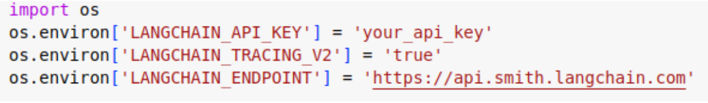
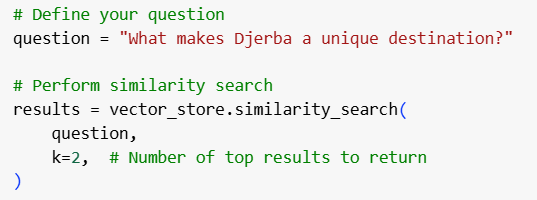
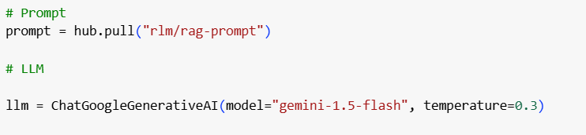

# GPT-like Chatbot with Retrieval Augmented Generation (RAG)

This project builds a **GPT-like chatbot** that answers your questions based on specific documents. This technique is known as **Retrieval Augmented Generation (RAG)**.

## Tools Used
We will use **LangChain**, a tool that simplifies connecting LLMs with external resources. This project also uses **ChromaDB** for the vector database and **Google Gemini** for model queries.

### Required Installations
You need to install LangChain, along with its interfaces for **ChromaDB** and **Google Gemini**.

---

## Getting API Keys

To run this code, you’ll need **two API keys**:
1. **LangChain API Key** (for debugging purposes)
2. **Gemini API Key** (to call the model)

### 1. LangChain API Key

- Create an account on [LangChain's website](https://smith.langchain.com).
- Go to **Settings** and generate your API key.
- Add the generated key to your Colab notebook with the following code:
  
```python
os.environ['LANGCHAIN_API_KEY'] = 'your-api-key-here'
```

This code enables you to access and monitor code execution using **LangSmith**.


---

### 2. Gemini API Key

- Visit [Google AI Studio](https://ai.google.dev/tutorials/setup) to get your Gemini API key.
- Click on **"Get an API key"** and create a key in the **Google AI Studio**.
- Use this key to access the model.

---

## Loading the Data

You can load your data using **Pandas** for CSV files:

```python
import pandas as pd
data = pd.read_csv('your-file.csv')
```

If your data is in another format (PDF, Web Page, etc.), use the corresponding loader. In this script, I created my data and saved it in a CSV file.

> **P.S.** Don’t forget to upload your file to the notebook!

---

## Creating a Vector Database

We will use **ChromaDB** to store our document embeddings. ChromaDB supports various embeddings like OpenAI, Google, and Huggingface. In this assignment, we use **Google AI embeddings**, but you’re welcome to use any embeddings you prefer. Ensure that your embeddings are correctly added to the database.

---

## Searching the Database

You can search for documents in the database using the `similarity_search` method.

```python
results = vector_db.similarity_search(query, k=5)
```

In this example, `k` refers to the number of documents you want to retrieve.



---

## Setting up the LLM

For this example, we use the **Gemini Pro** model, but you can choose any model you prefer. You can also set the **temperature** for the model's response:

- **Temperature 0**: Deterministic (same answer for the same input).
- **Higher Temperature**: Increases output randomness.
- **Warning**: Temperatures above 1.5 may decrease the quality of the output and generate nonsensical answers.



---

## Adding an Interface

We use **Gradio** to quickly create an interface for the chatbot. The interface allows you to type your question and receive an answer.

---

## Demo

Check out a demo of the chatbot in action:


